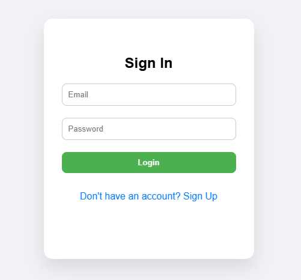
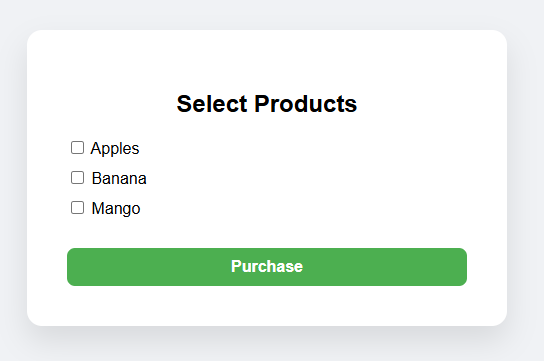
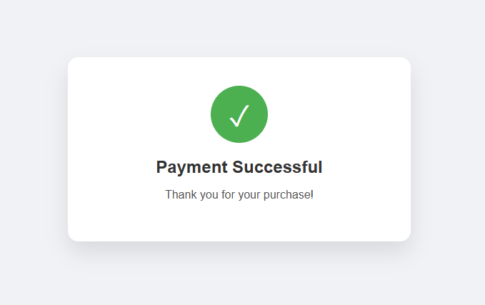

# 🛒 Microservices Architecture with HTTP APIs

This is a small web application built in **GoLang** with the following features:
- User Sign Up & Sign In
- Product selection and purchase
- Payment flow with database updates
- Session management to persist user data


## ⚙️ Tech Stack

- **GoLang**
- **Gorilla Mux** (Routing)
- **GORM** (ORM)
- **MySQL** (Database)
- **Gorilla Sessions** (Session management)
- **HTML/CSS** (Frontend pages)
- **godotenv** (Environment config)


## 🛠️ Project Structure
```
/myproject 
│ 
├── main.go 
├── config/ 
│ ├── db.go 
│ ├── env.go 
│ └── session.go 
│ 
├── models/ 
│ └── models.go 
│ 
├── handlers/ 
│ └── handlers.go 
│ 
├── routes/ 
│ └── router.go 
│ 
├── templates/ 
│ ├── index.html 
│ ├── products.html 
│ ├── payment.html 
│ └── success.html 
│
├── utils/ 
│ └── email.go 
│
├── .env 
└── go.mod
```


## 📌 How to Run

### 1. Clone the repository

```bash
git clone https://github.com/PJ9172/microservices.git
cd microservices 
```
### 2. Install Go Libraries
``` bash
go get github.com/gorilla/mux
go get gorm.io/gorm
go get gorm.io/driver/mysql
go get github.com/gorilla/sessions
go get github.com/joho/godotenv
go get github.com/jordan-wright/email
```

### 3. Set up .env file
```
DB_USER=your_db_user
DB_PASS=your_db_password
DB_NAME=your_db_name

SMTP_HOST=smtp.gmail.com
SMTP_PORT=587
SMTP_USER=your@gmail.com
SMTP_PASS=your-app-password
```

### 4. Run the application
```bash
go run main.go
```
#### App runs at: http://localhost:8000


## 📸 Screenshots
- ### 🧾 Sign In / Sign Up (Flip-style)
     <br>

- ### 🛍️ Product Selection Page
    

- ### ✅ Payment Success Page (with animation)
    

